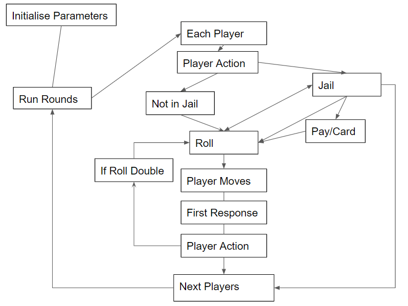
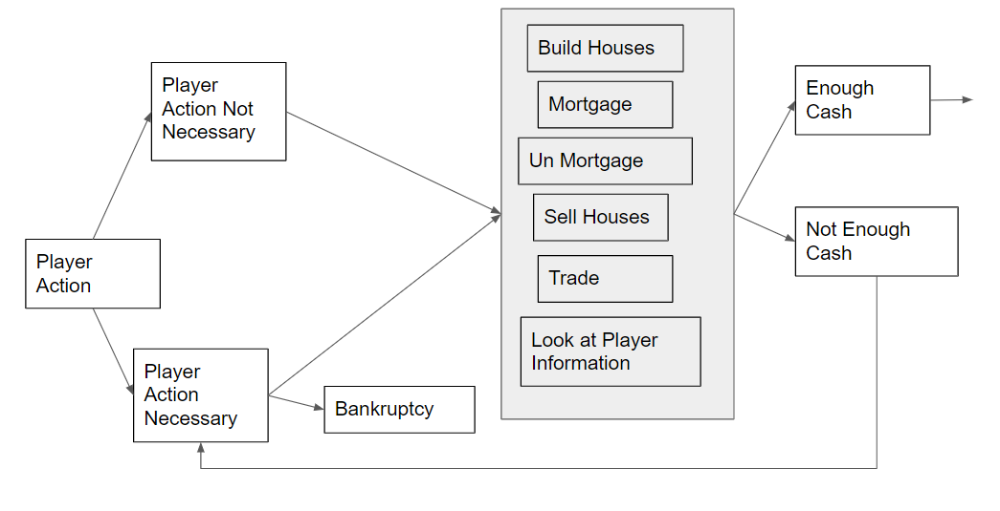

# Monopoly game in Java

## Running the Program
In the command line of the source directory\
Run javac *.java \
then run java Main  

## Overview 

I am currently learning Java and thought it would be fun to create a monopoly game on command line.\
The librarys are very basic and the goal was to familiarise myself with objects, instincts, classes and ect on Java. \
I was hoping to one day create an AI for the game

## Overall Game play

There can be 2 to 6 players. \
The initial amount given to each players is $1500\
There will be 1000 rounds played\
There are no limits to the number of properties.\
The names and characteristics are based on the Monopoly US version.

## Difference between the board game

In the game, when provided with a choices, some choices are final as state FINAL.\
This represents the reality of real world. For example, when you have deided to buy a property and do not have enough money to buy, an option of eithering auctioning or commiting to buy by raising fund will be present. This decision is final because before deciding to buy, the liquidation value is state.
Liquidation Value is the possible funds you can raise. Since you have then commited to buy and thus you should up hold that commitment. If the liquidation value is less than the value, then you can raise it through trade but you take the risk in that the trade may fall through.If you do not have the required funds, your only option would be trade or bankruptcy.  

During an auction, in each cycle of bidders, you can only ONCE attempt to raise funds. Note that if you bid a value, you must uphold to it if you win the auction. For example, if your avaliable cash is $150 and you bid $150, then you spent that money before the completition of the auciton, such as trading or unmortgage or building property and you also win the auction, you MUST pay that $150 otherwise you will declare bankruptcy. If you declare bankruptcy, the auction will start again.

The chance and community decks are shuffled once at the beginning of the game. Once a player draw a card and enacts on the commands, it is then placed at the bottom of the deck. If a player draw a Get of out Jail Card, that card is then given to the player. Once the player uses the card, it is then put at the bottom of the respective deck.

If the player chooses to declare bankruptcy, they will liquidise all their assets by selling all their houses/hotels, mortgaging all their properties. If the liquidisation produces enough money to pay the creditor, then the creditor receives the cash and then the mortgage property is auctioned to the highest bidder. This is a similar motion if the player quits. However, if the player can not produce enough cash to the creditor, the creditor will recieve all the player's property deeds. If the bank is the creditor, the bank will auction these mortgage properties to the highest bidder. 
## Coding the game

The flow of the game can be described by the following diagram.

### Initalise Parameters
The overall game needs to initalise how many players and their names. 

### Running Rounds
The game will run 1000 rounds. Each round consist of going through all the players until either 1000 rounds are completed or there is one player left in the game. 

### Players Action

Before rolling, the player has several options to raise funds or trade. This can be described in the player's action diagram.

The players action is presented before the roll, after arriving at the new position. Before the roll and when the player has a positive cash flow after the roll, it is deemed not necessary. If after the roll, the player does not have a positive cash flow, it is demmed necessary. The difference between necessary and not necessary is that even though both have standard actions, necessary players action has a choice of bankruptcy and cannot continue unless they have a positve cash flow. For example, if the player lands on Income tax and must pay $200 but only has $100 cash, then the player must raise $100 cash to continue or declare bankruptcy.

The standard actions are buidling a house, mortgaging, un mortgaging, selling houses, trade. Mortgaging, selling houses and trading are ways of raising cash in order to have a positive cash flow. Building houses and un mortgaging property can only be completed if they have the necessary cash flow. 

### Roll
After the players action, the player will either be in Jail or not in Jail due to the previous round.\
If the player is in Jail, they will have a choice of rolling for double, pay $50 bond or use a Get out of Jail free card if they have one. If they do not pay or use the card or do not roll a double, they will remain in Jail unless its their third time not rolling a double in which they will have to pay $50 and continue with the game. If they remain in Jail, the next player plays their turn.\
If they are not in Jail, their roll will update their current position. 

### Player moves
There are 40 spaces in which if they pass 40th square, they will automatically get $200 unless otherwise stated. Once they arrived at their position, they will have to peform different types of responses. The most common are paying rent or buying property. They could land on a chance or community square which a card will dictacte their actions and demands a response. 

### First Response

Based on the position or the reading the community or chance card, there are 9 types of responses that the player can perform.

These responses are described below.

#### Type 0
When the player lands on 0 or 20 where they just simply move positions. 

#### Type 1
The player lands on a position or a card where they must pay or receive a set payment

#### Type 2
The player arrives on a chance or community square and then is asked to moved to a position that has a property.

#### Type 3
The player recieves or pays an amount that is dependent on the number of surviving players. This only occurs from a community/chance card

#### Type 4
A chance card where it moves the player to the closest utlity and makes the player pay the owner a factor above the rent. If there are no owners, then the player can buy or auction the card

#### Type 5
A chance card where it moves the player to the closest station and makes the player pay the owner a factor above the rent. If there are no owners, then the player can buy or auction the card
 
#### Type 6
A card that makes the player pay an amount based on their ownership of the numbers of houses and hotels.

#### Type 7
The player recieves a get of out jail card

#### Type 8
After landing on a chance square, the player takes 3 steps back. There are 3 possibiltes, after taking a step back. \
1. Paying an income tax
2. Arriving on a property
3. Arriving on a community square

#### Type 9
The player arrives on a property. If the property is unowned, then the player can either auction or buy the property. Note that their decision is final as explained above. If the property is already owned, the player must pay rent unless that property is mortgaged. If the player has enough money, then the game contines, otherwise, the player action is presented (necessary) and the player must rasie the funds otherwise decalre bankruptcy.

### Player Action
Once the first response is completed, the player will be presented with another player action (un necessary).

 

